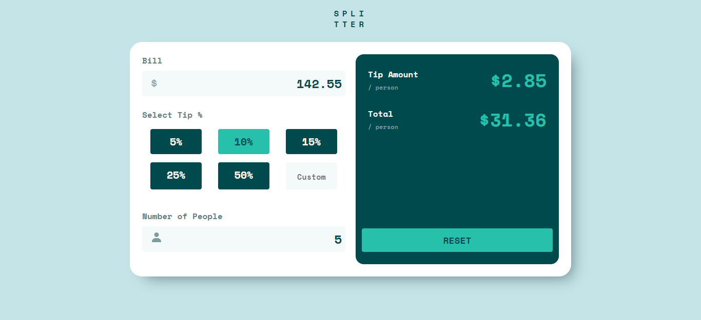

# Tip Calculator Español

Este es una calculadora de frontend mentor que consiste en un pequeño código que calcula la factura por cliente y monto total. **Visita el link: [https://eid4m.github.io/](https://eid4m.github.io/)**

## Tecnologias Usadas

- **HTML**
- **CSS**
- **VANILLA JS**

## Vistas

## Referencia

- [Challanges Tip Calculator](https://www.frontendmentor.io/challenges/tip-calculator-app-ugJNGbJUX)
- [Code Github](https://github.com/EstivenM99/tip-calculator-challanges)
